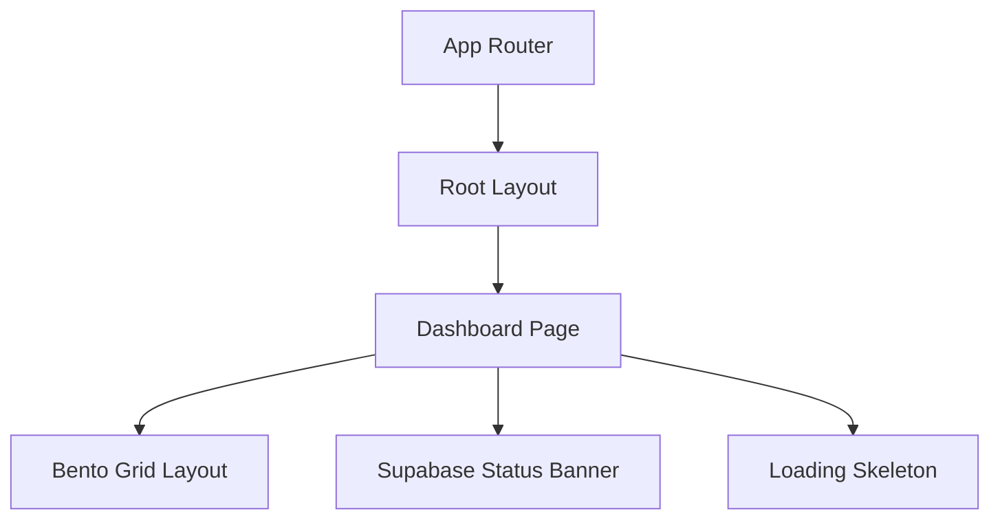
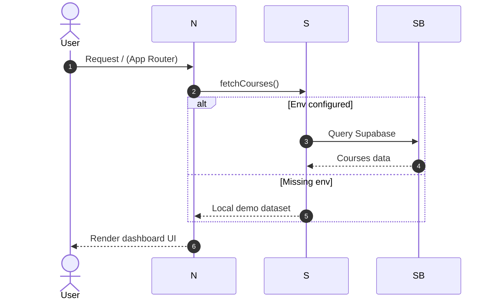

# Aether

Aether is a Next.js App Router student dashboard with a glassmorphism UI, animated interactions, and optional Supabase-backed data.

> Note: This README focuses on the app shell, routing, styling, and data flow. Component and lib implementation details are intentionally omitted.

## What this app does

- Renders a dashboard page with a responsive bento grid layout.
- Uses server-side data fetching in the App Router page.
- Shows a Supabase status notification for live vs demo data.
- Provides a skeleton loading state while fetching.

## Architecture (high level)



## Data flow (Supabase + demo fallback)



## Tech stack

- Next.js (App Router)
- React 19
- Tailwind CSS v4 (via PostCSS)
- Framer Motion
- Lucide React
- Supabase JS

## Project structure

```
src/
	app/
		layout.tsx      # App shell, fonts, layout chrome
		page.tsx        # Dashboard page (server component)
		loading.tsx     # Skeleton UI
		globals.css     # Global styling + utilities
public/
	noise.png         # UI texture overlay
supabase_setup.sql  # DB schema + seed data
```

## Environment variables

Create .env.local and add:

```
NEXT_PUBLIC_SUPABASE_URL=...
NEXT_PUBLIC_SUPABASE_ANON_KEY=...
```

If these are missing, the app falls back to local demo data.

## Supabase setup

1. Open the Supabase SQL editor.
2. Run the script in supabase_setup.sql to create and seed the courses table.
3. Enable RLS and the public read policy as provided in the script.

## Scripts

```
npm run dev
npm run build
npm run start
npm run lint
```

## Notes

- Global styles define glassmorphism helpers, skeleton animation, and scrollbars.
- The root layout sets font variables and the two-column app chrome (sidebar + main).

## License

MIT
