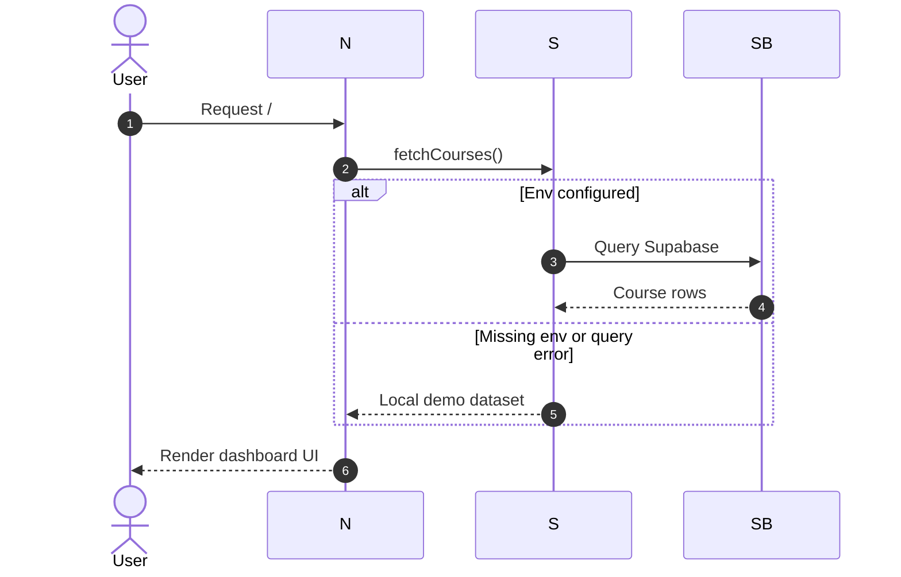

# Aether

> A Next.js App Router learning dashboard with glassmorphism UI, animated bento tiles, and Supabase-backed data.

---

## Highlights

- Responsive bento-grid dashboard layout with motion-driven tile animations
- Live Supabase data when environment variables are provided
- Automatic fallback to local demo data when Supabase isn't configured
- Polished skeleton loading state for improved perceived performance
- Sidebar that adapts to mobile, tablet, and desktop widths
- Activity heatmap generated client-side for the last 18 weeks
- Course cards with dynamic visual accents based on progress level

---

## Tech Stack

| Layer | Technology |
|---|---|
| Framework | Next.js (App Router) |
| UI Library | React 19 |
| Language | TypeScript |
| Styling | Tailwind CSS v4 (via PostCSS) |
| Animations | Framer Motion |
| Icons | Lucide React |
| Database | Supabase JS |

---

## Getting Started

**1. Install dependencies**

```bash
npm install
```

**2. Run the dev server**

```bash
npm run dev
```

**3. Open the app**

```
http://localhost:3000
```

---

## Environment Variables

Create `.env.local` in the project root:

```env
NEXT_PUBLIC_SUPABASE_URL=your_supabase_url
NEXT_PUBLIC_SUPABASE_ANON_KEY=your_supabase_anon_key
```

> If these are missing, the dashboard automatically uses a local demo dataset — no setup required.

---

## Supabase Setup

1. Open the Supabase SQL editor
2. Run the SQL in `supabase_setup.sql` to create and seed the `courses` table
3. Ensure the public read policy is enabled (the script sets this up automatically)

---

## Project Structure

```
src/
├── app/
│   ├── layout.tsx          # Root layout, fonts, sidebar + main shell
│   ├── page.tsx            # Dashboard page (server component)
│   ├── loading.tsx         # Skeleton UI
│   └── globals.css         # Theme tokens + global utilities
├── components/
│   ├── sidebar.tsx         # Responsive navigation
│   ├── hero-tile.tsx       # Welcome + XP + streak summary
│   ├── course-tile.tsx     # Progress cards
│   ├── activity-tile.tsx   # Heatmap-style activity grid
│   ├── bento-grid.tsx      # Animated layout wrapper
│   └── supabase-alert.tsx  # Data source status banner
└── lib/
    ├── supabase.ts         # Supabase client + Course type
    └── courses.ts          # Data fetch with demo fallback
public/
└── noise.png               # UI texture overlay
supabase_setup.sql          # DB schema + seed data
```

---

## App Flow



---

## Scripts

```bash
npm run dev      # Start development server
npm run build    # Create production build
npm run start    # Serve production build
npm run lint     # Lint the codebase
```

---

## UI Notes

- Global styles include glassmorphism helpers, glow effects, and skeleton animations
- The activity heatmap is generated client-side for the last 18 weeks
- Course cards dynamically change visual accents based on progress level

---

## License

MIT